# Sparta Node app in with DevEnv and CI
This repo will take you through running this node app on your virtual machine and checking the changes made to the app and testing it on a Jenkins CI server.

# Starting the app
To start the virtual machine and run the app on your device you should follow all the prerequisites and instructions.

## Prerequisites
- Click on the below repo, and follow the steps to downloading Ruby, then vagrant, then virtual box. Ignoring step 4 for now.

  - https://github.com/khanmaster/vb_vagrant_installtion
- Once all 3 programmes are installed clone this repo on your device.

  - copy the url link of this repo
  - Open your bash terminal as admin
  - In the directory you want the repo follow these commands
  - git init
  - git clone <pasted link>

## Main Commands
- First check if there is a .vagrant/ file in the repo using
```bash
ls -a
```
- Run command to initiate vagrant in the repo if no .vagrant file is found
```bash
vagrant init
```

- Run this command for a list of your installed plugins
```bash
vagrant plugin list
```

- If it shows `vagrant-hostsupdater` you can move on
- If not: install the plugin using this command
```bash
vagrant plugin install vagrant-hostsupdater
```
- For more information on this plug in view https://github.com/agiledivider/vagrant-hostsupdater or scroll to the extra commands section of this documentation.

- Run this command to start runnning the Virtual Machine
```bash
vagrant up
```

- Run these commands to enter the running app and db VM's respectivley
```bash
 vagrant ssh app
 vagrant ssh db
```

- If the app is ready to run, you can go to the port 3000 for the home of the app. Type into the url `http://192.168.10.100:3000`

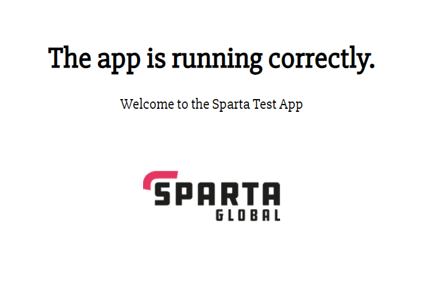


# Continuous Intergration with Jenkins
To set up a Jenkins server that continously runs tests on the app you set up follow the instructions.

Jenkins is one of the more popular CI/CD automation server. In this read me are instructions to setup and continually test out our multi machine vagrant repo in Jenkins whenever changes are pushed to our repo.

## Login
- First connect to a jenkins server. In this example a server was already set up for us using aws
- You should log in, the page should look like this

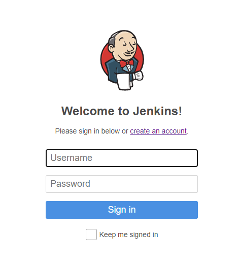

## New Item for pushing to git branch
- Now we need to set up a new item that is connected to our repo with an ssh key and a webhook, so that it can continously check for updates.
- Click on new item (top left, enter your name and choose a freestyle project fr now)

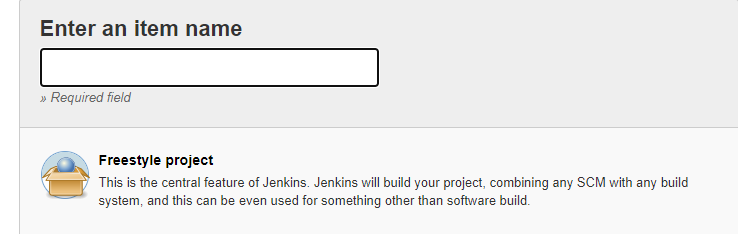

#### General
- Enter a description of the item, and select the general settings you want.
   - In this case we only wanted to keep records of the last 2 builds.
- Also click github project and enter the url of the repo that we are working with.

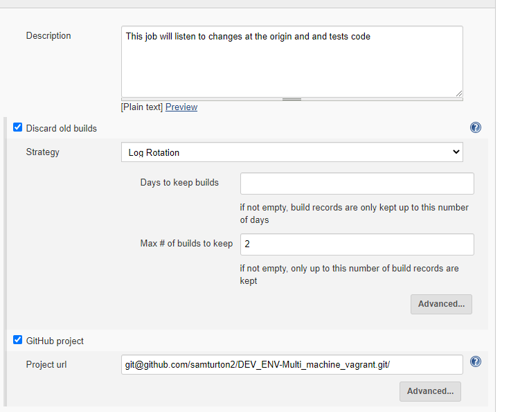

#### Office 365 Connector
- For now we will only restrict where this project can be run, so it only runs on the sparta test environment (which should be similar to the vagrant development environment we were working with on this app)

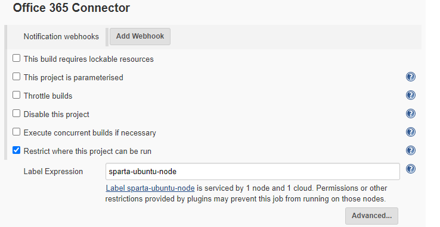

##### Connecting to microsoft teams
- In office 365 connector click add webhook
- Then the microsoft teams channel you want to connect to click the options bar, and connectors, and click configure jenkins
- Enter a name for your jenkins connector and copy the url it gives you.

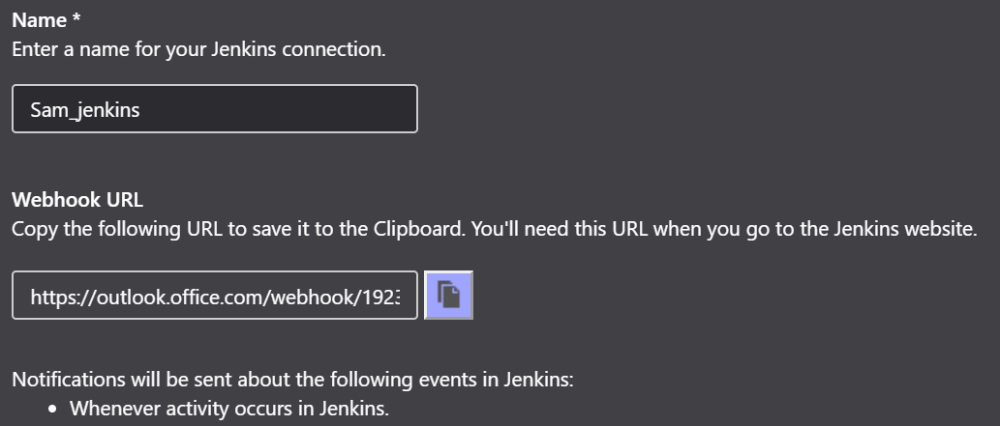

- In jenkins paste the url for notification webhooks and name the connection again.

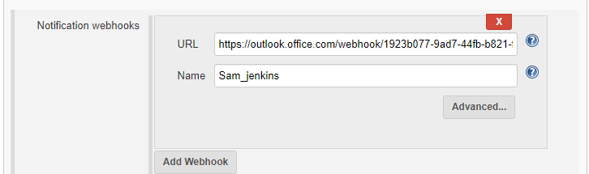

#### Source Code Management
- This is the stage we will generate our ssh keys if you haven't already.
###### getting a key
- In the terminal generate a private and public key pair with the ssh keygen command. e.g  `ssh-keygen -t ed25519`
    - Enter a logical name for the key
    - You dont need a passphrase for now
- On your github, go to settings/ssh keys, and add the public ssh key you generated to here.
- Next go to your repo and copy the ssh key url

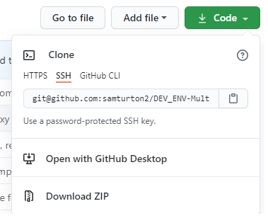

- On jenkins, tick git, and past the url into repo url.
- On credentials, add a new key, select the kind as ssh, enter a description of the key, tick private key, and copy and paste the private ssh key we generated earlier in here.

###### Already have a key
- Select your existing linked key in credentials


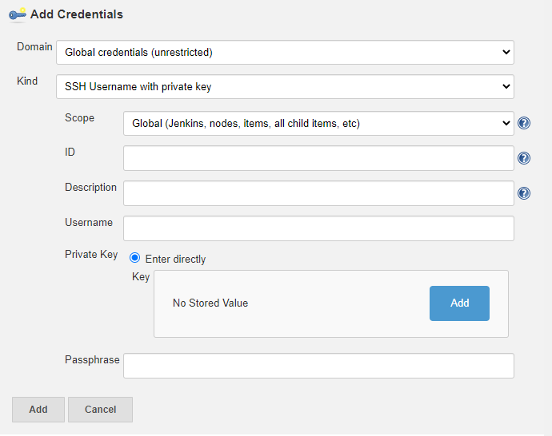

- If we want to keep track of builds to the branches off main (which we would do in a larger project) we need to add a branch to keep track of. Do this in branch specifier. In my case i have put `*/dev*` to keep track of any branches with dev in the name.

#### Build Triggers
- We need to select GitHub hook trigger
- Go to our github repo and select repo settings, and select Webhooks.
  - In here we want to add a new webhook
  - In payload URL enter the base url of our Jenkins Server followed by /github-webhook/ e.g. `http://<baseurl>/github-webhook/`
  - Select send me everything for now and add the webhook

#### Build Environment
- For our app we have node.js installed, so click Provide Node & npm bin to PATH, and select the sparta node js installation.

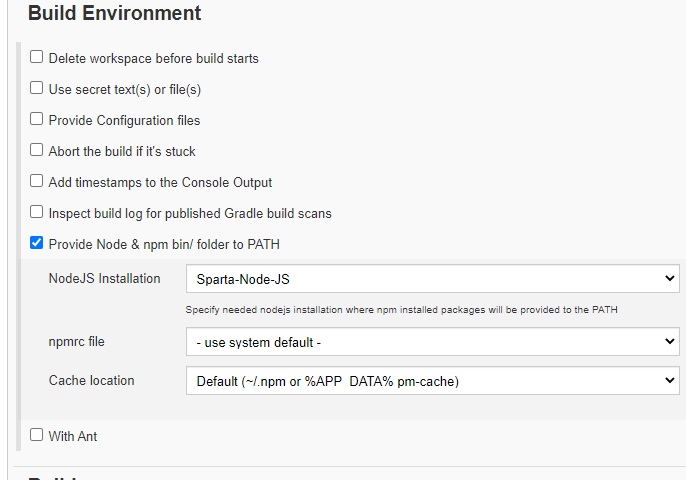

#### Build
- Now we need to test our app.
- To do this we add a build step and execute a shell command.

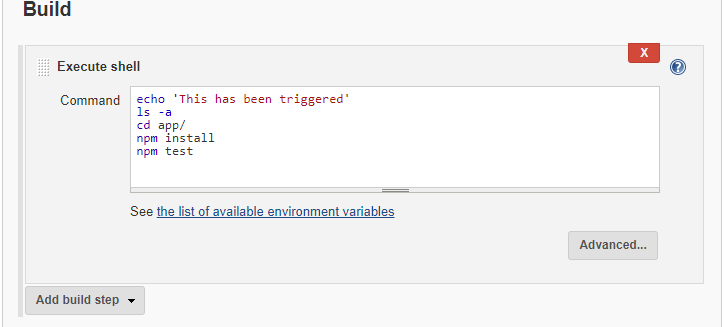

- The echo command just lets us know the shell command process has started. 
- The ls -a is a could command to check the directory your in for error handling
- We need to cd into our app folder and run the tests on it to check its running

#### Post-Build Action
- Select git publisher and tick push only if build succeeds. This will only make changes to the dev branches if the tests of the app pass.

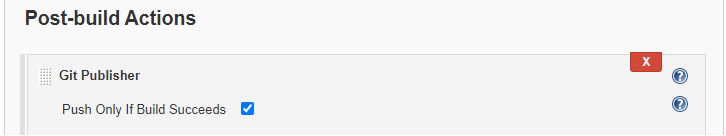

- Finally click save and the item should show up on the dashboard.

## Trigger build
- make a change to the repo read me and click on our jenkins item.
- The build history should show a blue dot if the tests have passed and a red dot if they have failed.

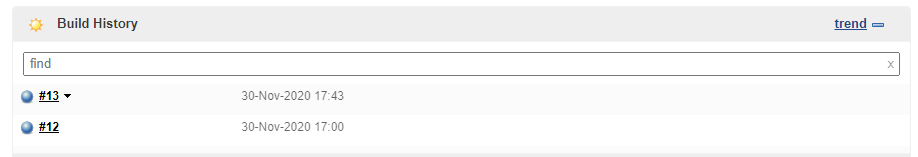

- We can look at the console output of the build for error handling. Click on the build and click on consol output

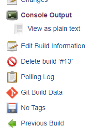

- Here we can see if any tests have failed, and make the checges necessesary which should then be triggered by the webhook

## New item for merging to main
- Create a new item again and name it appropriately, choosing freestyle project.
- Tick discard old builds
- Link your github repo
- Restrict the project to sparta ubuntu node
- link the git repo ssh urlm and specify the branches to build as the dev branches.
- Click additional behaviours, and specify origin and push to main

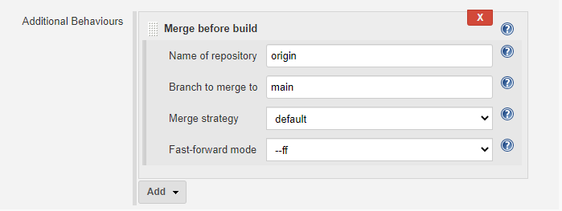

- Link the git with a hook trigger
- We dont need anything from build environment or build

#### Post Build actions
- Click git publisher and tick merge results, to merge to the main once the pre-build merging is complete.

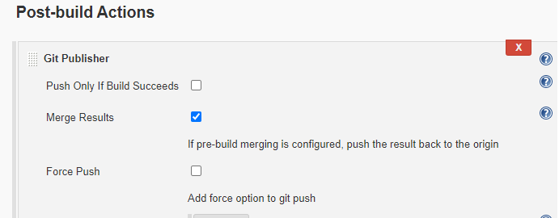


# Behind the scenes, terminal tests, extra commands
## Behind the scenes
- Vagrant up should run the the provision.sh files in both the db and the app folders in the environment folder

#### app provision.sh
- In this file we can see all shell commands to install the packages necessary to running this app in the app VM. 
- Before starting the app we use our bash commands to declare the environment variable `DB_HOST` to direct the app to the db ip address and link the two
- If you open the vagrant file in the main directory, you should see the `config.vm.provision` command (line 17)  telling the programme to run the provision installation commands once the virtual environment is up and running.
- The final paragraph in the provision file are the commands to run the app, as you open the VM. Can # it out and enter manually if you dont want the app to run instantly.
- line 30 - 35 is the process of syncing a reverse proxy file so that the app can run when the alias is typed straight into the url

#### db provision.sh
- In this file we can see all shell commands to install the packages necessary
for running a MongoDB in the db virtual machine
- If you open the vagrant file in the main directory, you should see the config.vm.provision command (line 17) telling the programme to run the provision installation commands once the virtual environment is up and running.
- In the vagrant file, notice the line which syncs a config folder to the VM. This folder has a copy of the mongo config file with the bing IP address changed manually to 0.0.0.0. In the provision file (before the mongodb is started), it commands the vm to copy and replace the config file with my manually edited one, so the IP address is changed accordingly. The perpose of this is so the app can read the db from any ip address.

## Testing
- Open a new terminal whilst the virtual environment is still running.
- To install gems from the gemfile run
```bash
bundle install
```
- Install the gem bundler
```bash
gem install bundler
```
- `cd` into the directory of the `Rakefile` which should be in the `tests` folder. e.g  `cd ./tests`

- Run this command to install the tests
```bash
bundler
```

- Run these commands to test the environments have all the packages needed

##### app virtual environment
```bash
rake spec:app
```
- This should return 18 passing tests, if the app is set up correctly.
- If the versions are incorrect, (max 4 failures), you can ignore it for now.

##### db virtual environment
```bash
rake spec:db
```
- All the tests should pass if mongodb is running in the correct place

## Extra commands
- Whilst in the app vm, you can stop the app using
```bash
pm2 stop app
```

- Start it again having `cd home/ubuntu/app`
```bash
pm2 start app.js
```

- To exit the running environment
```bash
exit
```

- To destroy the Virtual Machine once exited. (`vagrant up` to start running one again)
```bash
vagrant destroy
```

- To suspend the Virtual Machine
```bash
vagrant suspend
```

- To resume the VM once suspended 
```bash
vagrant resume
```

- To check the status of any `<package>` you should have in your VM. Enter this command in your VM terminal
```bash
sudo systemctl status <package>
```

- If for any reasons the `provision.sh` file commands havent ran and the relevant packages arent installed in the VM, copy the commands from the `provision.sh` file and manually paste them in the VM, and run the testing again.

- If Type Error with the `vagrant-hostsupdater`, still finding a fix, but for now can # out the `config.vm.hostname = "www.` line in the Vagrantfile. Can then enter the app by typing the ip address in the url.


#### This is a change to the read me on dev-changes_to_readme branch

- `git checkout -b <new branch>` was used to create a new branch
- `git branch` was used to view branches
- `git branch -d <old branch>` was used to delete the local branch once its changes had been pushed and merged to main

